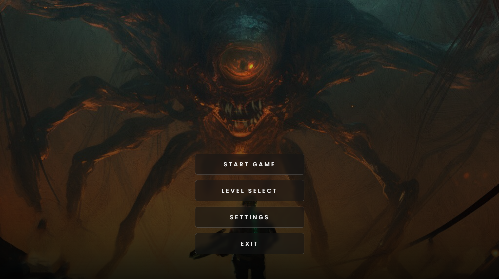
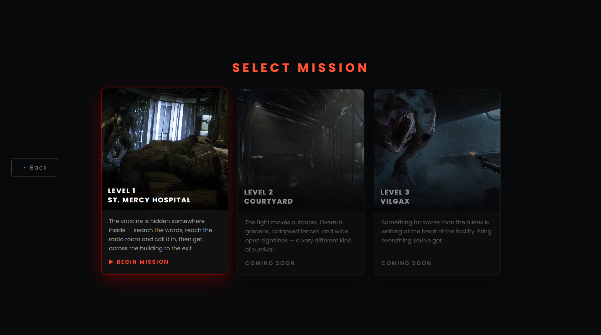
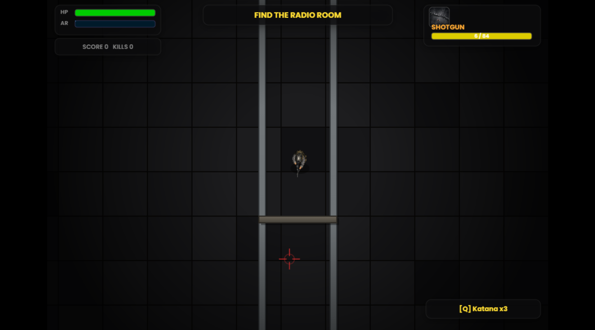

# Alien Shooter 

---

## Description

**Alien Shooter** is a browser-based top-down survival shooter set inside **Hospital**, a facility overrun by hostile alien creatures.

The player must explore the hospital, locate a randomly hidden vaccine, reach the Radio Room to request extraction, and survive the final wave before reaching the Exit Corridor.

The game combines **top-down shooting, exploration, resource management, enemy encounters, interactive environments, and an objective-driven extraction system**.

Built from scratch using **HTML5 Canvas, JavaScript, CSS, and Web Audio**, without a traditional game engine.

---

## Gameplay

The current playable mission follows a simple objective-driven progression:

```text
Explore Hospital
       ↓
Find Vaccine
       ↓
Reach Radio Room
       ↓
Call Extraction
       ↓
Survive Alien Wave
       ↓
Reach Exit Corridor
       ↓
Mission Complete
```

The vaccine is placed randomly within eligible hospital rooms, requiring the player to explore the map rather than following a fixed route.

---

## Features

* **Top-down combat** with mouse aiming and keyboard movement
* **Multiple weapons** — Pistol, Assault Rifle, Shotgun, and Katana
* **Randomized objective** — vaccine location changes between runs
* **Hospital exploration** across interconnected rooms and corridors
* **Multiple enemy types** with different combat characteristics
* **Interactive doors** that trigger room encounters
* **Medkit system** for health recovery
* **Breakable environmental objects**
* **Dynamic enemy spawning** during extraction
* **Radio-based extraction objective**
* **Score and kill tracking**
* **Pause and restart functionality**
* **Custom background music and sound effects**
* **Mission complete / failure states**

The implemented weapon controls are `1/2/3` for firearms and `Q` for the Katana, with `H` used for medkits.

---

## Weapons

| Weapon            | Role                           | Control |
| ----------------- | ------------------------------ | ------- |
| **Pistol**        | Reliable, accurate sidearm     | `1`     |
| **Assault Rifle** | High-rate automatic weapon     | `2`     |
| **Shotgun**       | High-damage close-range weapon | `3`     |
| **Katana**        | Limited-charge melee attack    | `Q`     |

The Katana performs an area attack around the player and consumes one charge per use.

---

## Enemy Types

The current build contains three enemy variants:

* **Runner** — fast, aggressive enemy
* **Crawler** — slower, more durable enemy
* **Tank** — high-health heavy enemy

Different rooms contain different enemy combinations, making exploration progressively more dangerous.

---

## Hospital Map

The first level is designed around a large **loop corridor surrounding a central sealed area**, with rooms branching from all four sides.

### Current Areas

* Reception
* Waiting Hall
* Laboratory
* Pharmacy
* Storage
* Generator Room
* Security Room
* Radio Room
* ICU
* Emergency Ward
* Exit Corridor

---

## Extraction System

The extraction sequence is designed as a multi-stage objective rather than a single end-point.

### 1. Locate the Vaccine

The vaccine is placed randomly in one of the eligible hospital rooms.

### 2. Reach the Radio Room

After collecting the vaccine, the player must reach the Radio Room and interact with the radio.

### 3. Trigger Extraction

Calling the helicopter starts the final phase of the mission.

### 4. Reach the Exit

Additional aliens spawn through the hospital corridors while the player makes their way to the Exit Corridor.

---

## Screenshots

### Title Screen



---

### Level Selection



---

### Gameplay




---

## Controls

| Input                  | Action        |
| ---------------------- | ------------- |
| `W A S D` / Arrow Keys | Move          |
| Mouse                  | Aim           |
| Left Click             | Fire          |
| `R`                    | Reload        |
| `1`                    | Pistol        |
| `2`                    | Assault Rifle |
| `3`                    | Shotgun       |
| `Q`                    | Katana        |
| `E`                    | Interact      |
| `H`                    | Medkit        |
| `ESC`                  | Pause         |

---

## Technical Implementation

The game is implemented using a custom JavaScript game loop and the **HTML5 Canvas API**.

### Core Systems

```text
Game
│
├── Player
│   ├── Movement
│   ├── Health
│   ├── Weapons
│   └── Inventory
│
├── Combat
│   ├── Bullets
│   ├── Weapon Switching
│   ├── Damage
│   └── Melee Attack
│
├── Enemies
│   ├── Runner
│   ├── Crawler
│   └── Tank
│
├── Environment
│   ├── Walls
│   ├── Doors
│   ├── Furniture
│   └── Breakable Objects
│
├── Objectives
│   ├── Vaccine
│   ├── Radio
│   └── Extraction
│
└── Audio / Effects
    ├── Music
    ├── SFX
    ├── Particles
    └── Screen Shake
```

The hospital is constructed programmatically from room definitions, structural walls, doors, furniture and corridor geometry.

---

## Project Structure

```text
Alien_Shooter/
│
├── alien_shooter.html
│
├── Assets/
│   ├── soldier.png
│   ├── alien11.png
│   ├── alien10.png
│   └── alien9.png
│
├── assets/
│   ├── start.jpg
│   ├── hospital.jpg
│   ├── hospital2.jpg
│   ├── hospital3.jpg
│   ├── pistol.jpeg
│   ├── ar.jpeg
│   ├── shotgun.jpeg
│   ├── pistol.mp3
│   ├── ar.mp3
│   ├── shotgun.mp3
│   ├── reload.mp3
│   ├── creep.mp3
│   └── bgm.mp3
│
├── screenshots/
│   ├── title-screen.png
│   ├── level-selection.png
│   ├── final-game.png
│   └── level-complete.png
│
└── README.md
```

---

## Tech Stack

* **JavaScript** — Core gameplay and game logic
* **HTML5 Canvas** — Rendering and game world
* **CSS3** — Menus, HUD and interface
* **Web Audio API** — Dynamic audio and sound effects
* **HTML5** — Browser-based deployment

---

## Getting Started

### Clone the repository

```bash
git clone https://github.com/MayankBelwanshi30/Alien_Shooter.git
cd Alien_Shooter
```

### Run the game

Open:

```text
alien_shooter.html
```

For development, a local server such as **VS Code Live Server** is recommended.

---

## Current Status

### Version 0.1 — St. Mercy Hospital

| System              | Status     |
| ------------------- | ---------- |
| Main Menu           | ✅ Complete |
| Level Selection     | ✅ Complete |
| Mission Briefing    | ✅ Complete |
| Hospital Level      | ✅ Complete |
| Player Movement     | ✅ Complete |
| Combat System       | ✅ Complete |
| Weapons             | ✅ Complete |
| Alien AI            | ✅ Complete |
| Random Vaccine      | ✅ Complete |
| Radio / Extraction  | ✅ Complete |
| Audio System        | ✅ Complete |
| Mission Completion  | ✅ Complete |
| Courtyard — Level 2 | 🔄 Planned |
| Vilgax — Level 3    | 🔄 Planned |

---

## Future Improvements

### Gameplay

* Additional campaign levels
* New alien variants
* Boss encounters
* More weapons and equipment
* Difficulty levels
* Player progression and upgrades
* Improved enemy pathfinding
* Additional environmental interactions

### Level Design

* **Level 2 — Courtyard**
* **Level 3 — Vilgax**
* Additional hospital sections
* New environments and combat arenas
* Larger interconnected maps

### Technical

* Improved enemy AI
* Persistent save system
* Controller support
* Mobile controls
* Performance optimization
* Improved animation system
* More advanced particle and lighting effects

---

## Development Goals

The project is being developed incrementally, with the current hospital mission serving as the foundation for a larger multi-level survival shooter.

The primary focus is on:

* Responsive top-down combat
* Clear objective-driven gameplay
* Modular enemy and weapon systems
* Procedurally varied objectives
* Expandable level architecture
* Browser-native performance

---

## License

This project is currently developed as a personal game project.

---

## Roadmap

```text
[v0.1] St. Mercy Hospital
       │
       ├── Combat
       ├── Weapons
       ├── Alien AI
       ├── Extraction
       └── Audio
             │
             ▼
[v0.2] Courtyard
       │
       ├── New Environment
       ├── New Enemies
       └── Expanded Combat
             │
             ▼
[v0.3] Underground Facility
       │
       ├── New Mechanics
       └── Advanced Enemies
             │
             ▼
[v1.0] Vilgax
       │
       └── Final Boss Encounter
```

---

## Author

**Mayank Belwanshi**

A personal game-development project exploring **JavaScript game programming, Canvas rendering, AI behavior, procedural level systems, combat mechanics, and interactive game design**.

---

